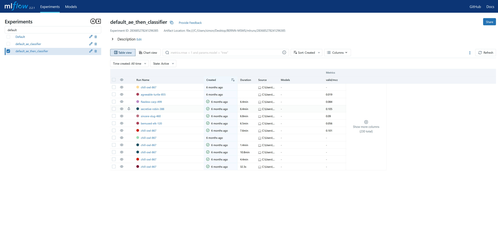
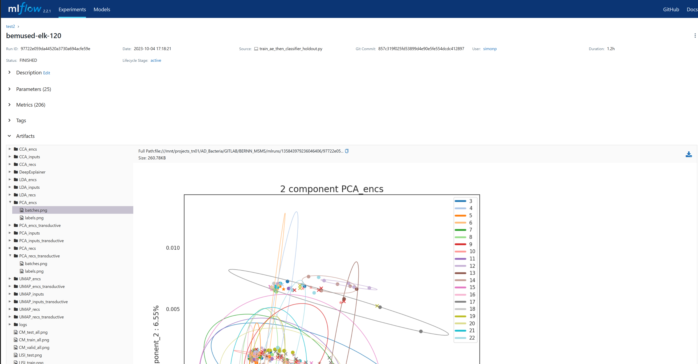
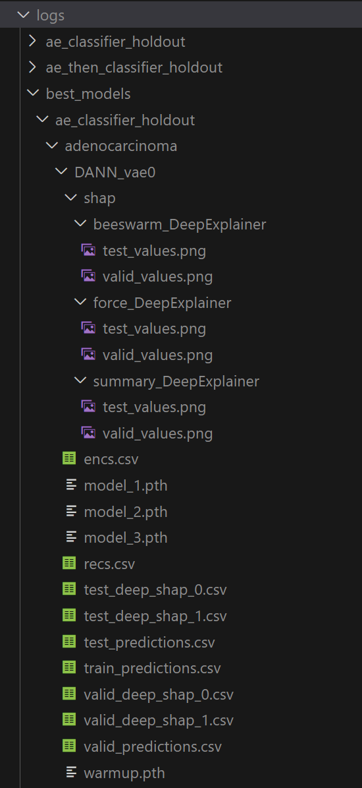

# BERNN-MSMS: Batch Effect Removal Neural Networks for Tandem Mass Spectrometry. 

## Author

* Simon Pelletier

# Quickstart
Due to BERNN has a lot of dependencies, so the easiest way to use it with your data is to use the Docker image using `singularity`. To do so, follow these steps:

First, get the Docker image (should take ~5 to 10 minutes)
`docker pull spel00/bernn:latest`

Finally, use the Docker image with singularity. For example, 
`singularity exec docker://spel00/bernn:latest python bernn/dl/train/train_ae_classifier_holdout.py --device=cpu --dataset=custom --n_trials=20 --n_repeats=5 --exp_id=benchmark --path=data/benchmark --csv_file=intensities.csv --pool=0`

or

`singularity exec docker://spel00/bernn:latest python bernn/dl/train/train_ae_then_classifier_holdout.py --device=cpu --dataset=custom --n_trials=20 --n_repeats=5 --exp_id=benchmark --path=data/benchmark --csv_file=intensities.csv --pool=0`

To run the examples above on GPU, you need to install the `nvidia-container-toolkit` on your machine. On Debian/Ubuntu, install using the command `apt-get install -y nvidia-container-toolkit`. You also need to add the option `--nv` the command to the above commands. For example, the first `singularity` command becomes:

`singularity exec --nv docker://spel00/bernn:latest python bernn/dl/train/train_ae_classifier_holdout.py --device=cpu --dataset=custom --n_trials=20 --n_repeats=5 --exp_id=benchmark --path=data/benchmark --csv_file=intensities.csv --pool=0`

The example above should take ~20 minutes per repetition to run on an Nvidia A100. Here their is 5 repeats per trial, so ~1h30 hour per trial (each trial is to test a new hyperparameters combination). Thus, for 20 trials it should take at least 1 day. The training time is highly dependent on the size of the dataset.

To use BERNN with your own dataset, replace `--path=data` with the path to the data directory that contains the data, replace `--csv_name=intensities.csv` with the name of the csv containing the data and replace `--exp_id=benchmark` with a name for the experiment.

The csv format is specified in the section `Custom experiments` below.

# Install
All install steps should be done in the root directory of the project.  
Everything should take only a few minutes to install,
though it could be longer depending on your internet connection.  
The package was tested on Windows 10 and Ubuntu 20.04.4 LTS with Python 3.10.11 and R 4.2.2. 

## Install python dependencies
`pip install -r requirements.txt`

## Install R dependencies
`install.packages("harmony")`
`install.packages("sva")`
`devtools::install_github("immunogenomics/lisi")`

## Install package
`pip install -e .`

## Other requirements
The scripts should be run on a machine with a GPU that supports CUDA (which should be installed).  
To verify that CUDA is installed, run the command `nvidia-smi` on a terminal. If it is installed, the CUDA version shoud appear.  
To verify that pyTorch is properly installed with CUDA support, run the 

## Training scripts
The main scripts for training models are located in src/dl/train.  
Use `train_ae_then_classifier_holdout.py` 
to train a model that freezes the autoencoder and DANN/revTriplet/invTriplet layers of the network after the warmup. 
The labels classifier is then trained alone after the warmup. The models for the alzheimer dataset reach better
scores using this file.  

Use `train_ae_classifier_holdout.py` to keep training the autoencoder and 
DANN/revTriplet/invTriplet layers of the network after the warmup.
The models for the datasets amide (adenocarcinoma) and mice 
(AgingMice) reach better classification scores using this file.

## Demo run
Here are some commands to try the training scripts with only a few epochs. The number of warmup epochs is a tunable 
hyperparameter, thus for a demo run it can be lowered directly in the training scripts, close to the end of the script.
Look for the where the class TrainAE is instantiated, the parameters are right after. By default, the number of warmup
epochs is between 10 and 250. For a demo run, it can be lowered to 1 and 10.
 
Each command runs 20 trials of 5 different splits of the data.
 

These are minimal examples. For more complete descriptions of the available arguments, see the section [Arguments](##Arguments) below.

### Alzheimer dataset
In the root directory of the project, run the following commands: 

`python src\dl\train\train_ae_then_classifier_holdout.py --groupkfold=1 --embeddings_meta=2 --device=cuda:0 --n_epochs=10 --dataset=alzheimer --n_trials=20 --n_repeats=5 --exp_id=test_alzheimer1 --path=data/Alzheimer/`

`python src\dl\train\train_ae_classifier_holdout.py --groupkfold=1 --embeddings_meta=2 --device=cuda:0 --n_epochs=10 --dataset=alzheimer --n_trials=20 --n_repeats=5 --exp_id=test_alzheimer2 --path=data/Alzheimer/`

### Adenocarcinoma dataset
In the root directory of the project, run the following command: 

`python src\dl\train\train_ae_then_classifier_holdout.py --groupkfold=1 --device=cuda:0 --dataset=amide --n_trials=20 --n_repeats=5 --exp_id=test_amide1 --path=data/`

`python src\dl\train\train_ae_classifier_holdout.py --groupkfold=1 --device=cuda:0 --dataset=amide --n_trials=20 --n_repeats=5 --exp_id=test_amide2 --path=data/`

### AgingMice dataset
In the root directory of the project, run the following command: 

`python src\dl\train\train_ae_then_classifier_holdout.py --groupkfold=1 --device=cuda:0 --dataset=mice --n_trials=20 --n_repeats=5 --exp_id=test_mice1 --path=data/`

`python src\dl\train\train_ae_classifier_holdout.py --groupkfold=1 --device=cuda:0 --dataset=mice --n_trials=20 --n_repeats=5 --exp_id=test_mice2 --path=data/`

### Custom dataset
In the root directory of the project, run the following command: 

`python src\dl\train\train_ae_then_classifier_holdout.py --groupkfold=1 --device=cuda:0 --dataset=custom --n_trials=20 --n_repeats=5 --exp_id=<NameOfExperiment> --path=<path/to/folderContainingCsvFile> --csv_name<csvFileName>`

`python src\dl\train\train_ae_classifier_holdout.py --groupkfold=1 --device=cuda:0 --dataset=custom --n_trials=20 --n_repeats=5 --exp_id=<NameOfExperiment> --path=<path/to/folderContainingCsvFile> --csv_name<csvFileName>`

# Run experiments
To reproduce the 3 experiments from the [BERNN paper](https://pubmed.ncbi.nlm.nih.gov/37461653/), use the two bash files (`launch_train_ae_then_classifier_holdout_experiment.sh` or 
`launch_train_ae_classifier_holdout_experiment.sh`). These files can only be run on Linux. The first script was used to train the models for the Alzheimer dataset and the second for the adenocarcinoma and AgingMice datasets.  

These files can also be modified to run on any other csv files, given they follow the structure described in the next subsection () of this README file.

It was designed to run on two NVIDIA RTX 3090 GPUs of 24 GB each. If not enough GPU RAM available, modify the file to reduce the
number of models trained simultaneously. The number of GPU can also be modified.

Each experiment might take a few days to run, depending on the size of the dataset. The results will be saved in the `mlflow` folder.

## Custom experiments
To run with custom data, you need to change the parameter `--dataset` to `custom` and change `--path` to the path 
relative to this `README` file. Alternatively, you can set it to the absolute path where the data is. 

Your dataset must be:
- comma seperated (csv)
- Rows are samples
- Columns are features
- first column must be the sample IDs
- second column must be the labels
- third column must be the batch IDs

# Train scripts
The main scripts for training models are located in src/dl/train. 

# Observe results
## Observe results from a local machine 
On local machine terminal: 
`mlflow ui`

Open in browser: 
`http://127.0.0.1:5000/`

## Observe results from a server on a local machine 
On server, use the command: 
`mlflow server --host=0.0.0.0`

Open in local browser: 
`http://<server-ip-adress>:5000/`

Example of a mlflow user interface:  

When clicking on the experiment's run name, a menu where the run id, parameters, metrics and images from multiple analysis can be found.

## Logs
All results are also logged in the `logs` folder, which is automatically created when the first results are generated. All results are stored either in `logs/ae_classifier_holdout` or `logs/ae_then_classifier_holdout`, depending on the training scenario. The ids of the files in which each run is stored can be found in `mlflow`. To find it, first click on the experiment's name , then on the run's name (see 1st image of the example of the mlflow user interface). The run id can be found on the top of the page (see example 2nd image).

All runs logs can be accessed this way, be more conveniently, the results of the best run of each of BERNN's models are found in the `logs/best_models` folder (see the image below).

### shap folder

#### Beeswarm Deep Explainer

#### summary_DeepExplainer

### CSV files

#### Encoded representations
The `encs.csv` file contains the encoded values given by the encoder of the autoencoder. They are the values that are used for the classification neural network. 

The rows are the samples and the columns are the learned features. Each row contains the results of a sample and the columns are the features, except for the first column which contains the samples names, the second column contains the batch numbers and the third contains the labels.

#### Reconstructed representations
The `recs.csv` file contains the reconstructed features from the trained model. The rows are the samples and the columns are the initial features. Please note that the features are corrected for batch effects, but might not be as accurate as the encoded values to train a classifier. They could be used for downstream analyses (e.g. for differential analysis), but some biological signal could be lost compared to the encoded features. Rather than using this approach, we recommend using the shap values to get the features importance for the classification task, even if classification is not the end goal of the experiment. 

The rows are the samples and the columns are the learned features. Each row contains the results of a sample and the columns are the features, except for the first column which contains the samples names, the second column contains the batch numbers and the third contains the labels.

#### shap

The `shap` folder contains the values for the shap analysis. `beeswarmp` contains contains the values used to get the `beeswarm` plot, which contains the importance of each feature for the decision of each individual samples. `OTHER ONE` contains the values for the overall importance of each features.

#### predictions
train_predictions.csv, etc
contains the prediction scores for each of the samples. (TODO: Columns need to be defined)

### Models weights

the `.pth` files contain the weights of each of the models trained. `model_i` (where `i` is the i'th model) are each of the final models. `warmup.pth` is the unsupervised model learned during the warmup.

## Get best results and all batch correction metrics
To make a summary of the results obtained in an experiment, use the command: `python3 mlflow_eval_runs.py --exp_name <NameOfExperiment>`<br\>

## Arguments
    --dataset (str): ['custom', 'alzheimer', 'amide', 'mice']
    --n_trials (int): Number of trials for the baeysian optimization of hyperparameters
    --n_repeats (int): Number of repeats in the repetitive holdout
    --exp_id (str): Name of the mlflow experiment
    --device (str): Name of the device to use ['cuda:0', 'cuda:1', ...]
    --use_mapping (bool): Use mapping of the batch ID into the decoder
    --rec_loss (str): Reconstruction loss type ['l1', 'mse']
    --variational (boolean): Use a variational autoencoder?
    --groupkfold (boolean): Use group k-fold? With this command, all the 
        samples from the same batch will be in the same set. E.g. All  samples from batch 1 will all be either in the training, validation or test set (https://scikit-learn.org/stable/modules/generated/sklearn.model_selection.GroupKFold.html)
    --tied_weights (boolean): Use Autoencoders with tied weights?
    --train_after_warmup (boolean): Indicates if the autoencoder is trained after warmup.  
    --dloss (str): Domain loss ['no', 'revTriplet', 'invTriplet', 'DANN', 'normae']
    --early_stop (int): How many epochs the classifier is trained without improvement on the classification valid loss
    --n_epochs (int): The number of epochs the classifier is trained.
    --rec_loss (str): Which reconstruction loss to use ['l1', 'mse']
    --csv_file (str): Name of the `.csv` file

## Hyperparameters

The hyperparameters are optimized using Bayesian optimization. They are defined at the end of each train script, which 
are located in src/dl/train.
The parameters are the following:

    dropout (float): Number of neurons that are randomly dropped out. 
                     0.0 <= thres < 1.0
    smoothing (float): Label smoothing replaces one-hot encoded label vector 
                       y_hot with a mixture of y_hot and the uniform distribution:
                       y_ls = (1 - α) * y_hot + α / K
    margin (float): Margin for the triplet loss 
                    (https://towardsdatascience.com/triplet-loss-advanced-intro-49a07b7d8905)
    gamma (float): Controls the importance given to the batches adversarial loss
    beta (float): Controls the importance given to the Kullback-Leibler loss
    nu (float): Controls the importance given to the classification loss
    layer1 (int): The number of neurons the the first hidden layer of the encoder and the
                  last hidden layer of the decoder
    layer2 (int): The number of neurons the the second hidden layer (Bottleneck)
    ncols (int): Number of features to keep
    lr (float): Model's optimization learning rate
    wd (float): Weight decay value
    scale (categorical): Choose between ['none', 'minmax', 'robust', 'standard', 'minmax_per_batch', 'robust_per_batch', 'standard_per_batch']

